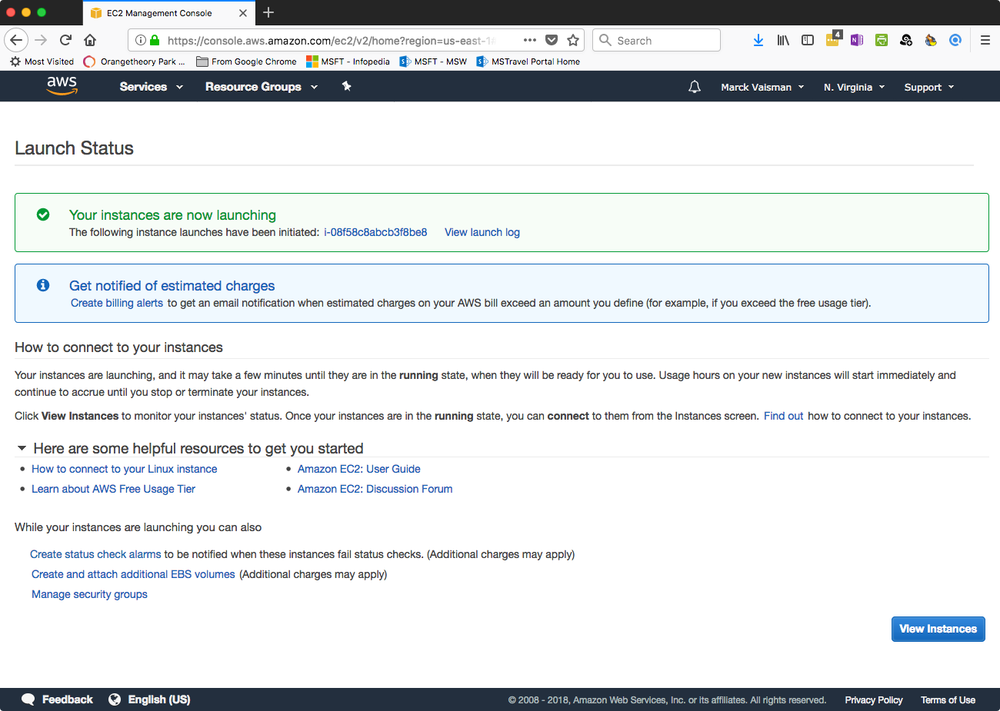

## Tutorial

This is a comprehensive tutorial to complement what we discussed in class. We will guide you step-by-step through the process of:

* starting an Amazon Virtual Machine (also referred to as instance, VM, EC2, remote server)
* connecting to it
* cloning your assignment repository on your remote machine
* performing some tasks on the VM (the actual assignment)
* pushing your repository back to GitHub to submit the assignment

In addition, there are some instructions you need to read and become familiar with before you do the assignment:

* setup a Security Group on AWS
* learn to use ssh-agent
* learn about terminal based text editors

The links below are shortcuts to the different sections of the document:

[Set up your public/private key pair](#set-up-your-public/private-key-pair)

[Git Tutorial](#git-tutorial)

[Creating a Security Group](#creating-a-security-group)

[Launching your first Linux instance on AWS](#launching-your-first-linux-instance-on-aws)

[Connecting to the remote server using Secure Shell ssh](#connecting-to-the-remote-server-using-secure-shell)

[Installing git in your remote machine](installing-git-in-your-remote-machine)

[Cloning your assignment repository](#cloning-your-assignment-repository)

[Using a text editor on your remote machine](#using-a-text-editor-on-your-remote-machine)

### Set up your public/private key pair

In class, we created our private/public keypair, and you uploaded your **public key** to your AWS account and to GitHub. 

### Git Tutorial

I found a very useful Git tutorial which is somewhat humorous. I think it is worth it for you to read through this tutorial: [git - the simple guide](http://rogerdudler.github.io/git-guide/).

### Creating a Security Group

Before we launch our first AWS EC2 instance, we will setup a _Security Group_ in the AWS Console. Each account comes with a default security group, but we will create a specific one that we will use to connect to our EC2 instance via ssh, which means it will open up port 22 on your instance.

* Log on to your [AWS Console](https://console.aws.amazon.com/) if you are not already logged in
* Go to the EC2 Dashboard. You can get here by clicking on **Services** in the top left and choosing **EC2** under the **Compute** heading
* Click on **Security Groups** on the left hand side of the EC2 console. If you don't see it, scroll down the left side panel until you see the **NETWORK & SECURITY** heading, and you will see the following:


* Click on **Create Security Group**. 
	* Enter a name for your security group (you can call it whatever you want; I called it **open-22** to make it easy.) 
	* Enter a description for your group
	* Leave the VPC value unchanged (your number will be different than the one shown below.)
	* Click on **Add Rule** towards the bottom
	* Select **SSH** from **Type**
	* Select **Anywhere** from **Source**
	* Click **Create**


* You have just created a security group that opens up port 22 and allows you to connect from anywhere, and you should see it in the Security Groups console (again, the group id will be different for each of you). You will use this group that you just created when you launch an instance for this assignment


### Launching your first Linux instance on AWS

This is a step-by-step guide on how to launch an instance.

* From the **EC2 Dashboard**, click on the **Launch Instance** button


* _Step 1: Choose an Amazon Machine Image:_ Select the **Amazon Linux 2 LTS Candidate AMI... (ami-428aa838)**. If you don't see this you can search for it by clicking the **Community AMIs** tab on the left and entering the ami number


* _Step 2: Choose an Instance Type:_ Select the **t2.micro** instance type, and click **Next**


* _Step 3: Configure Instance Details:_ Nothing to do here, click **Next**


* _Step 4: Add Storage:_ Nothing to do here, click **Next**


* _Step 5: Add Tags:_ Nothing to do here, click **Next**


* _Step 6: Configure Security Group:_ Select the **open-22 (or whichever name you gave it)** Security Group, click **Review and Launch**


* _Step 7: Review Instance Launch:_ You will see a warning about your security group being open to the world. You can ignore it, we know. Make sure that the AMI, the Instance Type, and the Security Group is what you wanted. Click **Launch**


* _Select an existing key pair or create a new key pair:_ **Make sure you select the key that you uploaded to AWS, otherwise you will not be able to connect to your machine. Click Launch Instances**


* _Launch Status:_ Click **View Instances** to go back to the EC2 Instances page



* In the EC2 Console, you will see the status of your instance. Sometimes the instances are launched immediately, but sometimes you have to wait. While waiting, you will see the Instance Status showing a yellow dot with "pending", otherwise it will be a green dot with "running"

* When the instance is in "running" state, it is ready to be used!

### Connecting to the remote server using Secure Shell ssh

We will be using the terminal with Secure Shell to connect to our remote instance. 

* Open a terminal on your laptop. If you have one already open, type `cd ~` to navigate back to your home directory
* Go to the EC2 Instances page (click on EC2, then on Instances on the left)
* Click on your running instance such that the select box is blue
* Click in the **Description** tab in the bottom if not already selected
* Hover with your mouse over the **Public DNS** text, and you will see a "Copy to Clipboard" icon to the right. Click on that to copy your instances DNS address.


* In the terminal, type `cd ~` to make sure you are in your home directory
* Type `ssh ec2-user@` and paste your DNS address
* If everything is configured correctly, the first time you connect to a host that you've never connected to, you will see something like this:

```
The authenticity of host 'ec2-54-163-133-120.compute-1.amazonaws.com 
(54.163.133.120)'can't be established.
ECDSA key fingerprint is SHA256:TeYrgHLkYHvD/zcp23bO3wozsLMyPSiSn+edPPo88zE.
Are you sure you want to continue connecting (yes/no)?
```
Note: your values for DNS, IP address and fingerprint will be different

* Enter `yes` and press enter. You will only need to enter yes once.
* If you are successful, you will see something like this:

```
The authenticity of host 'ec2-54-163-133-120.compute-1.amazonaws.com (54.163.133.120)' 
can't be established.
ECDSA key fingerprint is SHA256:TeYrgHLkYHvD/zcp23bO3wozsLMyPSiSn+edPPo88zE.
Are you sure you want to continue connecting (yes/no)? yes
Warning: Permanently added 'ec2-54-163-133-120.compute-1.amazonaws.com,54.163.133.120' (ECDSA) to the list of known hosts.
Last login: Thu Jan 25 01:41:17 2018 from pool-108-45-73-252.washdc.fios.verizon.net

       __|  __|_  )
       _|  (     /   Amazon Linux 2 AMI
      ___|\___|___|

https://aws.amazon.com/amazon-linux-2/
[ec2-user@ip-172-31-59-103 ~]$
```

**Congratulations, you have successfully connected to your remote instance!**


### Using ssh agent

One thing to keep in mind is that whenever you want to use your GitHub repository on your cloud resources, you will need to connect to your remote machines and use the SSH agent functionality to pass your ssh private key and store it in the remote server's memory. **You do not need to do this every time you connect to your remote machine; only when you want to clone/push a repository between your remote instance and GitHub.** 

You can read more about ssh-agent [here.](https://en.wikipedia.org/wiki/Ssh-agent)

If you are already connected to your remote host and did not use the ssh-agent, you can exit the remote terminal by typing `exit` and that will bring you back to your "local" terminal. 

__For Mac and Linux:__ 

* Type `ssh-add` in your terminal. You will get a confirmation that looks something like this:

```
➜  ~ ssh-add 
Identity added: /Users/marck/.ssh/id_rsa (/Users/marck/.ssh/id_rsa)
```
Note: if you have issues with `ssh-add` command on Mac/Linux, you can use the instructions for Windows. 

__For Windows:__ 

* in your Babun terminal, you need to use two commands: ``eval `ssh-agent -s` ``, and then `ssh-add`.

```
{ ~ } >> eval `ssh-agent -s`
Agent pid XXXX
{ ~ } >> ssh-add
Identity added: /home/xxxx/.ssh/id_rsa 
```

To log-on to the remote server with your ssh-agent, you need to use the `-A` parameter in your ssh command: `ssh -A ec2-user@...` where `...` is your instance's DNS. 

To test that the ssh-agent forwarded your private key to the remote machine you can test the connection to GitHub as we did before: 

* Type `ssh -T git@github.com` on your **remote** terminal
* If the `ssh-agent` worked properly, you should get a success message from GitHub:

```
[ec2-user@ip-172-31-59-103 ~]$ ssh -T git@github.com
Hi wahalulu! You've successfully authenticated, but GitHub does not provide shell access.
```

### Installing git in your remote machine

The AMI image we chose is a bare-bones Linux image. You will need to install git on the remote machine so you can clone/push your repository.

* At the remote terminal prompt, type: `sudo yum -y install git`

When git is finished installing, you will see something like this:


### Cloning your assignment repository

* After you visit the assignment link and accept, GitHub will automatically clone the starter repository and create one for you with the name of **[[prefix]]-[[your-GitHub-username]]** in the course's GitHub Organization site [https://github.com/gu-anly502](https://github.com/gu-anly502), where **[[prefix]]** is the assignment name 
* Go to the course GitHub site: [https://github.com/gu-anly502](https://github.com/gu-anly502) and you will only see your own repositories:


* Click on the assignment repository
* Click on the **Clone or download** green button towards the right
* Make sure that it says **Clone with SSH** inside the box. If it says **Clone with HTTPS** then click on the **Use SSH** link
* Copy the ssh URL (you can use the copy button to the right)


To clone your assignment repository on your local or remote machine, you need to use the following command:

`git clone [[your copied github ssh repository link]]`. Note: each student's repository name will be different and unique. Make sure you clone your repository from your home directory (on the remote machines) to keep things simple. When you do this, git create a sub-directory within your home directory that contains the contents of your repository.

```
[ec2-user@ip-172-31-59-103 ~]$ git clone git@github.com:gu-anly502/demo-assignment-marckvaisman.git
Cloning into 'demo-assignment-marckvaisman'...
remote: Counting objects: 9, done.
remote: Compressing objects: 100% (6/6), done.
remote: Total 9 (delta 0), reused 9 (delta 0), pack-reused 0
Receiving objects: 100% (9/9), done.
[ec2-user@ip-172-31-59-103 ~]$
```
Once you clone your repository, change directories and work within the repository directory: `cd my-repository-path`.

**Don't forget to commit your changes and push back to GitHub when you are done!**

After you finish your work, to push back to GitHub type `git push`

### Using a text editor on your remote machine

You will be creating and editing text files using a text editor on the remote machine. Remember, you are working on a remote machine so there is no graphical user interface (GUI) like Notepad, Texpad or your favorite editor. You will be using plain text editors in the command line. Most Linux distributions come with [nano](https://www.nano-editor.org/) and [vim](http://www.vim.org/) installed. Personally, I like `nano` but you are welcome to use `vim`. Click on the links to learn more about each editor.

